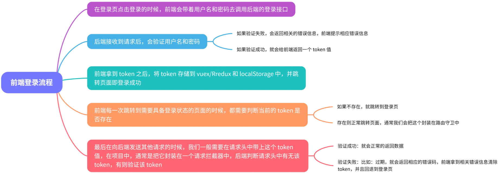

## MVVM

MVVM是Model-View-ViewModel缩写，也就是把MVC中的Controller演变成ViewModel。Model层代表数据模型，View代表UI组件，ViewModel是View和Model层的桥梁，数据会绑定到viewModel层并自动将数据渲染到页面中，视图变化的时候会通知viewModel层更新数据。

## Vue响应式数据原理

什么是响应式：数据发生改变的时候，视图会重新渲染，匹配更新为最新的值。

### Vue2响应式数据原理

**数据劫持-->收集依赖-->派发更新**

vue2响应式的基本逻辑：

1. 监听对象数组的变化。
2. 设置拦截，读取的时候进行依赖收集，设置的时候进行派发更新操作。

vue2对象和数组的响应式：

1. 对象响应化：递归遍历每一个key，使用Object.defineProperty()方法定义getter、setter。
2. 数组响应化：采用函数拦截方式，覆盖数组原型方法，额外增加通知逻辑。重写了数组的方法，vue将data中的数组进行了原型链的重写，指向了自己定义的数组原型方法。当调用数组API时，可以通知依赖更新。如果数组包含引用类型，会对数组中的引用类型再次递归遍历进行监控。

vue2实现响应式的基本过程：

1. 创建一个vue实例，将vue实例中的data数据传送给Obverse，在Obverse中用Object.defineProperty()方法对各个属性进行监听，同时创建Dep对象，一个属性对应一个Dep对象，Dep里调用addSub方法可增加订阅者。
2. 将el模板传送给Compile，解析el模板中的指令，一个指令对应创建一个Watcher，然后这个Watcher会指向对应属性的Dep对象。第一次创建vue实例时，会初始化视图，在view中显示第一次创建的属性。
3. 此时数据发生了变化，Obverse监听到数据发生了变化，就会在Dep对象里调用notify()方法并通知Watcher，Watcher会调用update方法对view视图进行更新，从而实现数据的响应。


### Vue3响应式原理

在vue3中，数据劫持中的Object.defineProperty方法改成了用ES6中的Proxy。Proxy可以监听整个对象，省去了递归遍历，可以有效提高效率。

**基本原理**：

1. 利用reactive注册响应式对象，对函数返回值操作。
2. 利用Proxy劫持数据的get,set,deleteProperty,has,own。
3. 利用WeakMap，Map，Set来实现收集依赖。

Proxy和Reflect是ES6新增的两个类，Proxy相比于Object.defineProperty更加好用，它解决了后者不能监听数组改变的缺点，并且还能劫持整个对象，并返回一个新对象，不管是从操作便利程度还是底层功能上来看，Proxy都远强于Object.defineProperty。Reflect可以拿到Object内部的方法，并且在操作对象出错时返回false不会报错。

vue3响应式的**优势**：

Object.defineProperty()方法无法通过监听数组内部的数据变化来实现内部数据的检测，而Proxy可以监听到数组内部的变化，也可以监听对象并非属性。

Proxy有多种拦截的方法，如apply，deleteProperty等，这是Object.defineProperty不具备的。

proxy的返回值是一个对象，可以直接进行操作，而defineProperty要先遍历所有对象的属性值才能进行操作。

**不足**：Object.defineProperty是ES5 的特性，所以兼容性相对来说要高一些。

## Vue生命周期

- beforeCreate:是new Vue()之后触发的第一个钩子，在当前阶段data、methods、computed以及watch上的**数据和方法都不能被访问**。
- created:在实例创建完成后发生，当前阶段已经完成了数据观测，也就是**可以使用数据，更改数据**，在这里更改数据不会触发updated函数。可以做一些初始数据的获取，在当前阶段**Dom还没有创建**，无法与Dom进行交互，如果非要想，可以通过vm.$nextTick来访问Dom。
- beforeMount:发生在挂载之前，在这之前template模板已导入渲染函数编译。而当前阶段**虚拟Dom已经创建完成，即将开始渲染**。在此时也可以对数据进行更改，不会触发updated。
- mounted:在挂载完成后发生，在当前阶段，**真实的Dom挂载完毕**，数据完成双向绑定，可以访问到Dom节点，使用$refs属性对Dom进行操作。
  **接口请求一般放在mounted中，但需要注意的是服务端渲染时不支持mounted，需要放到created中。**
- beforeUpdate:发生在更新之前，也就是**响应式数据发生更新，虚拟dom重新渲染之前被触发**，你可以在当前阶段进行更改数据，不会造成重渲染。
- updated:发生在更新完成之后，当前阶段组件**Dom已完成更新**。要注意的是避免在此期间更改数据，因为这可能会导致无限循环的更新。
- beforeDestroy:发生**在实例销毁之前，在当前阶段实例完全可以被使用**，我们可以在这时进行善后收尾工作，比如清除计时器。
- destroyed:发生在**实例销毁之后，这个时候只剩下了dom空壳**。组件已被拆解，数据绑定被卸除，监听被移出，子实例也统统被销毁。

### 接口请求一般放在哪个生命周期中

如果不需要操作DOM，就可以把接口请求放到created中，否则放在mounted中，mounted阶段el已经挂载，可以操作DOM。如果是服务端渲染，需要把接口请求放到created中，因为服务端渲染只支持beforeCreate和created两个钩子。

### 不常用的钩子

activated

- keep-alive 组件激活时调用，该钩子在服务器端渲染期间不被调用。

deactivated

- keep-alive 组件停用时调用，该钩子在服务器端渲染期间不被调用。

errorCaptured

- 当捕获一个来自子孙组件的错误时被调用。此钩子会收到三个参数：错误对象、发生错误的组件实例以及一个包含错误来源信息的字符串。此钩子可以返回 false 以阻止该错误继续向上传播你可以在此钩子中修改组件的状态。因此在模板或渲染函数中设置其它内容的短路条件非常重要，它可以防止当一个错误被捕获时该组件进入一个无限的渲染循环。

### 父子组件的生命周期

组件的调用顺序都是先父后子,渲染完成的顺序是先子后父。

组件的销毁操作是先父后子，销毁完成的顺序是先子后父。

执行的先后顺序为
父beforeCreate->父created->父beforeMount->子beforeCreate->子created->子beforeMount->子mounted->父mounted

父c->子c->子m->父m

子组件更新过程 父beforeUpdate->子beforeUpdate->子updated->父updated

销毁过程 父beforeDestory->子beforeDestory->子destoryed->父destoryed

## Vue里Computed和Watch的区别

**对于Computed：**

- 它支持缓存，只有依赖的数据发生了变化，才会重新计算
- 不支持异步，当Computed中有异步操作时，无法监听数据的变化
- computed的值会默认走缓存，计算属性是基于它们的响应式依赖进行缓存的，也就是基于data声明过，或者父组件传递过来的props中的数据进行计算的。
- 如果一个属性是由其他属性计算而来的，这个属性依赖其他的属性，一般会使用computed
- 如果computed属性的属性值是函数，那么默认使用get方法，函数的返回值就是属性的属性值；在computed中，属性有一个get方法和一个set方法，当数据发生变化时，会调用set方法。

**对于Watch：**

- 它不支持缓存，数据变化时，它就会触发相应的操作
- 支持异步监听
- 监听的函数接收两个参数，第一个参数是最新的值，第二个是变化之前的值
- 当一个属性发生变化时，就需要执行相应的操作
- 监听数据必须是data中声明的或者父组件传递过来的props中的数据，当发生变化时，会触发其他操作，函数有两个的参数：
  - immediate：组件加载立即触发回调函数
  - deep：深度监听，发现数据内部的变化，在复杂数据类型中使用，例如数组中的对象发生变化。需要注意的是，deep无法监听到数组和对象内部的变化。

当想要执行异步或者昂贵的操作以响应不断的变化时，就需要使用watch。

**总结：**

- computed 计算属性 : 依赖其它属性值，并且 computed 的值有缓存，只有它依赖的属性值发生改变，下一次获取 computed 的值时才会重新计算 computed 的值。
- watch 侦听器 : 更多的是**观察**的作用，**无缓存性**，类似于某些数据的监听回调，每当监听的数据变化时都会执行回调进行后续操作。

**运用场景：**

- 当需要进行数值计算,并且依赖于其它数据时，应该使用 computed，因为可以利用 computed 的缓存特性，避免每次获取值时都要重新计算。
- 当需要在数据变化时执行异步或开销较大的操作时，应该使用 watch，使用 watch 选项允许执行异步操作 ( 访问一个 API )，限制执行该操作的频率，并在得到最终结果前，设置中间状态。这些都是计算属性无法做到的。

## v-if和v-show的区别

相同点：
v-show和v-if都能控制元素的显示和隐藏。

不同点：
1.实现本质方法不同:v-show本质就是通过设置css中的display设置为none;控制隐藏v-if是动态的向DOM树内添加或者删除DOM元素;
2.v-show都会编译，初始值为false，只是将display设为none，但它也编译了;v-if初始值为false，就不会编译了
总结：v-show只编译一次，后面其实就是控制css，而v-if不停的销毁和创建，如果要频繁切换某节点时，故v-show性能更好一点。

## 为什么要避免v-if和v-for一起使用

vue2.x版本中，当 v-if 与 v-for 一起使用时，v-for 具有比 v-if 更高的优先级；
vue3.x版本中，当 v-if 与 v-for 一起使用时，v-if 具有比 v-for 更高的优先级。
官网明确指出：避免 v-if 和 v-for 一起使用，永远不要在一个元素上同时使用 v-if 和 v-for。

可以先对数据在计算数据中进行过滤，然后再进行遍历渲染；
操作和实现起来都没有什么问题，页面也会正常展示。但是会带来不必要的性能消耗；

## 组件中的data为什么是一个函数？

一个组件被复用多次的话，也就会创建多个实例。本质上，这些实例用的都是同一个构造函数。如果data是对象的话，对象属于引用类型，会影响到所有的实例。所以为了保证组件不同的实例之间data不冲突，data必须是一个函数。

## v-model的原理

v-model本质就是一个语法糖，可以看成是value + input方法的语法糖。 可以通过model属性的prop和event属性来进行自定义。原生的v-model，会根据标签的不同生成不同的事件和属性。

v-mode做了两件事：绑定数据value；触发输入事件input。

v-model 在内部为不同的输入元素使用不同的property并抛出不同的事件

- text和textarea 元素使用value property 和 input事件
- checkbox 和radio使用checked property 和 change事件
- select 字段将value 作为prop 并将change 作为事件

## VUE中的事件绑定原理

```javascript
// 原生事件绑定
<div @click="fn()"></div>

// 组件绑定
<my-component @click.native="fn" @click="fn1"></my- component>
```

### 原生事件绑定

原生事件绑定是通过addEventListener绑定给真实元素的，

源码：

```javascript
function updateDOMListeners (oldVnode: VNodeWithData, vnode: VNodeWithData) { 
	if (isUndef(oldVnode.data.on) && isUndef(vnode.data.on)) { return }
	const on = vnode.data.on || {} const oldOn = oldVnode.data.on || {} 
	target = vnode.elm 
	normalizeEvents(on) 
	updateListeners(on, oldOn, add, remove, createOnceHandler, vnode.context) 
	target = undefined 
}
function add ( 
	name: string, 
	handler: Function, 
	capture: boolean, 
	passive: boolean 
) {
	target.addEventListener( // 给当前的dom添加事件 
		name, 
		handler, 
		supportsPassive 
		? {  capture, passive  } 
		: capture 
	) 
}
```

### 组件的事件绑定

组件事件绑定是通过Vue自定义的$on实现的，（可用event触发）。

```javascript
export function updateComponentListeners ( 
	vm: Component, 
	listeners: Object, 
	oldListeners: ?Object 
) {
	target = vm updateListeners(
		listeners, oldListeners || {}, 
		add, 
		remove,
		createOnceHandler, vm)
		target = undefined 
}

function add (event, fn) { 
	target.$on(event, fn) 
}
```

## 如何保存页面的当前的状态

既然是要保持页面的状态（其实也就是组件的状态），那么会出现以下两种情况：

- 前组件会被卸载
- 前组件不会被卸载

那么可以按照这两种情况分别得到以下方法：

**组件会被卸载：**

**（1）将状态存储在LocalStorage / SessionStorage**

只需要在组件即将被销毁的生命周期 `componentWillUnmount` （react）中在 LocalStorage / SessionStorage 中把当前组件的 state 通过 JSON.stringify() 储存下来就可以了。在这里面需要注意的是组件更新状态的时机。

比如从 B 组件跳转到 A 组件的时候，A 组件需要更新自身的状态。但是如果从别的组件跳转到 B 组件的时候，实际上是希望 B 组件重新渲染的，也就是不要从 Storage 中读取信息。所以需要在 Storage 中的状态加入一个 flag 属性，用来控制 A 组件是否读取 Storage 中的状态。

**优点：**

- 兼容性好，不需要额外库或工具。
- 简单快捷，基本可以满足大部分需求。

**缺点：**

- 状态通过 JSON 方法储存（相当于深拷贝），如果状态中有特殊情况（比如 Date 对象、Regexp 对象等）的时候会得到字符串而不是原来的值。（具体参考用 JSON 深拷贝的缺点）
- 如果 B 组件后退或者下一页跳转并不是前组件，那么 flag 判断会失效，导致从其他页面进入 A 组件页面时 A 组件会重新读取 Storage，会造成很奇怪的现象

**（2）路由传值**

通过 react-router 的 Link 组件的 prop —— to 可以实现路由间传递参数的效果。

在这里需要用到 state 参数，在 B 组件中通过 history.location.state 就可以拿到 state 值，保存它。返回 A 组件时再次携带 state 达到路由状态保持的效果。

**优点：**

- 简单快捷，不会污染 LocalStorage / SessionStorage。
- 可以传递 Date、RegExp 等特殊对象（不用担心 JSON.stringify / parse 的不足）

**缺点：**

- 如果 A 组件可以跳转至多个组件，那么在每一个跳转组件内都要写相同的逻辑。

**组件不会被卸载：**

**（1）单页面渲染**

要切换的组件作为子组件全屏渲染，父组件中正常储存页面状态。

**优点：**

- 代码量少
- 不需要考虑状态传递过程中的错误

**缺点：**

- 增加 A 组件维护成本
- 需要传入额外的 prop 到 B 组件
- 无法利用路由定位页面

除此之外，在Vue中，还可以是用keep-alive来缓存页面，当组件在keep-alive内被切换时组件的**activated、deactivated**这两个生命周期钩子函数会被执行 被包裹在keep-alive中的组件的状态将会被保留：

```js
<keep-alive>
	<router-view v-if="$route.meta.keepAlive"></router-view>
</kepp-alive>
```

**router.js**

```js
{
  path: '/',
  name: 'xxx',
  component: ()=>import('../src/views/xxx.vue'),
  meta:{
    keepAlive: true // 需要被缓存
  }
},
```


## Vue模版编译原理

Vue的编译过程就是将template转化为render函数的过程。会经历以下阶段：
首先解析模版，**生成AST语法树**(一种用JavaScript对象的形式来描述整个模板)。 使用大量的正则表达式对模板进行解析，遇到标签、文本的时候都会执行对应的钩子进行相关处理。Vue的数据是响应式的，但其实模板中并不是所有的数据都是响应式的。有一些数据首次渲染后就不会再变化，对应的DOM也不会变化。

**优化**过程就是深度遍历AST树，按照相关条件对树节点进行标记。这些被标记的节点(静态节点)我们就可以跳过对它们的比对，对运行时的模板起到很大的优化作用。

编译的最后一步是将优化后的AST树**转换为可执行的代码**。

## 虚拟DOM

虚拟DOM（Virtual Dom）即虚拟节点。虚拟DOM在Vue.js里做了两件事：

- 创建JS对象（虚拟节点），用来模拟真实DOM节点，该对象包含了真实DOM的结构及其属性
- 将虚拟节点与旧虚拟节点进行对比，然后更新视图（渲染）

### 操作真实 DOM 的代价

原生 JS 或 JQuery 操作 DOM 时，浏览器会从构建 DOM 树开始从头到尾执行一遍渲染流程。

比如：在一次操作中，我要更新 10 个 DOM 节点，浏览器收到第一个 DOM 请求后并不知道还有 9 次更新操作，因此会马上执行流程，最终执行10 次。第一次计算完时，紧接着下一个 DOM 更新请求，这个节点的坐标值就变了，前一次计算为无用功。

计算 DOM 节点坐标值等都是白白浪费的性能。即使计算机硬件一直在迭代更新，操作 DOM 的代价仍旧是昂贵的，频繁操作还是会出现页面卡顿，影响用户体验。

真实的DOM节点，哪怕一个最简单的div也包含着很多属性。

### 虚拟 DOM 的好处

虚拟DOM就是为了解决直接操作DOM导致的性能问题而被设计出来的。

使用了虚拟DOM之后，假如一次操作中有10次更新DOM的动作，虚拟DOM不会立即操作DOM，而是将这10次更新的diff内容保存到本地的一个js对象中，最终将这个js对象一次性attach到DOM树上，通知浏览器去执行绘制工作，这样可以避免大量的无用的计算量。

Virtual DOM 本质上就是在 JS 和 DOM 之间做了一个缓存。可以类比 CPU 和硬盘，既然硬盘这么慢，我们就在它们之间加个内存。既然 DOM 这么慢，我们就在它们 JS 和 DOM 之间加个虚拟DOM。CPU（JS）只操作内存（Virtual DOM），最后的时候再把变更写入硬盘（DOM）。

Virtual DOM的优势不在于单次的操作，而是在大量、频繁的数据更新下，能够对视图进行合理、高效的更新。

### 虚拟 DOM作用总结

- 提升渲染性能
  操作 DOM 会导致渲染很慢（每次操作DOM都会触发回流和重绘）。
  操作虚拟DOM实际是操作JS对象，可以将多次操作整合后再统一操作DOM。操作虚拟DOM时不会引起回流和重绘（即：不会引起渲染）
- 具备跨平台的优势
  Virtual DOM 基于JavaScript 对象而不依赖真实平台环境，所以它有跨平台的能力，比如：浏览器平台、Weex、Node 等。
- 提高开发速度
  无需手动操作DOM：只需要写好View-Model的代码逻辑，框架会根据虚拟DOM和数据双向绑定，帮我们更新视图；

## diff算法

当组件创建和更新的时候， vue 会执行内部的 update 函数，该函数使用 render 函数生成虚拟的 dom 树，找到差异点，最终更新到真实dom

将新旧对比差异的过程叫 *diff ,*vue 在内部通过一个叫做 patch 的函数来完成该过程。

在对比的过程，vue 采用深度优先，同级比较的方式进行比较，同级比较就是说它不会跨越结构进行比较，在判断两个节点是否相同的时候，是根据虚拟节点的 key 和 tag 来进行判断的。

具体来说，首先对根节点进行对比，如果相同则将旧节点关联的真实dom的引用挂到新节点上，然后根据需要更新属性到真实dom，然后再对比其子节点数组；如果不相同，则按照新节点的信息递归创建所有真实dom，同时挂到对应虚拟节点上，然后移除掉旧的dom。
在对比其子节点数组时，vue对每个子节点数组使用了两个指针，分别指向头尾，然后不断向中间靠拢来进行对比，这样做的目的是尽量复用真实dom，尽量少的销毁和创建真实dom。如果发现相同，则进入和根节点一样的对比流程，如果发现不同，则移动真实dom到合适的位置。
这样一直递归的遍历下去，直到整棵树完成对比。

简单来说，diff算法有以下过程

- 同级比较，再比较子节点
- 先判断一方有子节点一方没有子节点的情况(如果新的children没有子节点，将旧的子节点移除)
- 比较都有子节点的情况(核心diff)
- 递归比较子节点

正常Diff两个树的时间复杂度是O(n^3^ )，但实际情况下我们很少会进行跨层级的移动DOM，所以Vue将Diff进行了优化，从O(n^3^) -> O(n)，只有当新旧children都为多个子节点时才需要用核心的Diff算法进行同层级比较。

### Vue2的核心Diff算法

Vue2的核心Diff算法采用了双端比较的算法，同时从新旧children的两端开始进行比较，借助key值找到可复用的节点，再进行相关操作，直到某一个列表的节点全部遍历过，对比停止。但这比较的过程是全量diff，也就是每个节点都会彼此比较。当数据发生变化，它就会新生成一个DOM树，并和之前的DOM树进行比较，找到不同的节点然后更新。但其中很显然的是，有些节点中的内容是不会发生改变的，那我们对其进行比较就肯定消耗了时间。

### Vue3的核心Diff算法

Vue3.x的核心Diff算法采用了静态标记 + 非全量 Diff的方法，在创建虚拟DOM树的时候，会根据DOM中的内容会不会发生变化，添加一个静态标记。那么之后在与上次虚拟节点进行对比的时候，就只会对比这些带有静态标记的节点。同时使用最长递增子序列优化对比流程，可以最大程度的减少 DOM 的移动，达到最少的 DOM 操作


**Vue3的Diff算法**

基于最长递增子序列进行移动/添加/删除

### 虚拟DOM中key的作用

简单的说：key是虚拟DOM对象的标识，在更新显示时key起着极其重要的作用。
**「key的作用是尽可能的复用 DOM 元素」**
复杂的说：当状态中的数据发生了变化时，vue根据【新数据】生成【新的虚拟DOM】，随后vue进行【新虚拟DOM】与【旧虚拟DOM】的diff比较，比较规则如下：

旧虚拟DOM中找到了与新虚拟DOM相同的key
1.若虚拟DOM中的内容没有变，直接使用之前的真实DOM
2.若虚拟DOM中内容变了，则生成新的真实DOM，随后替换掉页面中之前的真实DOM

旧虚拟DOM中未找到与新虚拟DOM相同的key
1.根据数据创建新的真实DOM，随后渲染到页面

key的特殊属性主要用作vue的虚拟dom算法中，即在新旧nodes对比时辨识VNodes。

如果不使用key，vue会使用最大限度减少动态元素并且尽可能地尝试就地修改/复用相同类型元素的算法，而使用key时，它会基于key的变化重新排列元素顺序，并且会移除key不存在的元素。

key属性作为元素的唯一标识，加载过的数据标签不会再去进行循环，也不会进行渲染，从而能够提高性能。

### 用index作为key可能会引发的问题

若对数据进行：逆序添加/逆序删除等破坏顺序的操作，会产生没有必要的真实DOM更新，界面效果虽然没有问题，但是数据过多的话，会效率过低；
如果结构中还包含输入类的DOM，会产生错误DOM更新，界面有问题；
注意！如果不存在对数据的逆序操作，仅用于渲染表用于展示，使用index作为key是没有问题的。

## keep-alive

keep-alive可以实现组件缓存，当组件切换时不会对当前组件进行卸载。
常用的两个属性include/exclude，允许组件有条件的进行缓存。
两个生命周期activated/deactivated，用来得知当前组件是否处于活跃状态。
keep-alive的中还运用了LRU(Least Recently Used)算法。

## Vue组件通信方式

父子通信：

1. 父向子传递数据是通过props完成的，子向父传递数据是通过$emit/$on完成的。
2. $emit/$bus
3. vuex
4. 通过父链/子链也可以通信($parent/$children)
5. ref也可以访问组件实例

兄弟通信：

1. $emit/$bus
2. vuex

跨级通信：

1. $emit/$bus
2. vuex
3. provide/inject API
4. $attrs/$listeners
5. localstorage、sessionstorage

### props/$emit

父组件通过props的方式向子组件传递 子to父通过在子组件中 $emit, 父组件中 v-on 的方式实现。

#### 父组件向子组件传值

接下来我们通过一个例子，说明父组件如何向子组件传递值：在子组件Users.vue中如何获取父组件App.vue中的数据 users:["Henry","Bucky","Emily"]

```html
//App.vue父组件
<template>
  <div id="app">
    <users v-bind:users="users"></users>//前者自定义名称便于子组件调用，后者要传递数据名
  </div>
</template>
<script>
import Users from "./components/Users"
export default {
  name: 'App',
  data(){
    return{
      users:["Henry","Bucky","Emily"]
    }
  },
  components:{
    "users":Users
  }
}
//users子组件
<template>
  <div class="hello">
    <ul>
      <li v-for="user in users">{{user}}</li>//遍历传递过来的值，然后呈现到页面
    </ul>
  </div>
</template>
<script>
export default {
  name: 'HelloWorld',
  props:{
    users:{           //这个就是父组件中子标签自定义名字
      type:Array,
      required:true
    }
  }
}
</script>
```

总结：父组件通过props向下传递数据给子组件。注：组件中的数据共有三种形式：data、props、computed

#### 子组件向父组件传值（通过事件形式）

当我们点击“Vue.js Demo”后，子组件向父组件传递值，文字由原来的“传递的是一个值”变成“子向父组件传值”，实现子组件向父组件值的传递。

```html
// 子组件
<template>
  <header>
    <h1 @click="changeTitle">{{title}}</h1>//绑定一个点击事件
  </header>
</template>
<script>
export default {
  name: 'app-header',
  data() {
    return {
      title:"Vue.js Demo"
    }
  },
  methods:{
    changeTitle() {
      this.$emit("titleChanged","子向父组件传值");//自定义事件  传递值“子向父组件传值”
    }
  }
}
</script>

// 父组件
<template>
  <div id="app">
    <app-header v-on:titleChanged="updateTitle" ></app-header>//与子组件titleChanged自定义事件保持一致
   // updateTitle($event)接受传递过来的文字
    <h2>{{title}}</h2>
  </div>
</template>
<script>
import Header from "./components/Header"
export default {
  name: 'App',
  data(){
    return{
      title:"传递的是一个值"
    }
  },
  methods:{
    updateTitle(e){   //声明这个函数
      this.title = e;
    }
  },
  components:{
   "app-header":Header,
  }
}
</script>
```

总结：子组件通过events给父组件发送消息，实际上就是子组件把自己的数据发送到父组件。

### $emit/$on

**这种方法通过一个空的Vue实例作为中央事件总线（事件中心），用它来触发事件和监听事件,巧妙而轻量地实现了任何组件间的通信，包括父子、兄弟、跨级。**当我们的项目比较大时，可以选择更好的状态管理解决方案vuex。

1.具体实现方式：

```javascript
    var Event=new Vue();
    Event.$emit(事件名,数据);
    Event.$on(事件名,data => {});
```

2.举个例子

假设兄弟组件有三个，分别是A、B、C组件，C组件如何获取A或者B组件的数据

```html
<div id="itany">
	<my-a></my-a>
	<my-b></my-b>
	<my-c></my-c>
</div>
<template id="a">
  <div>
    <h3>A组件：{{name}}</h3>
    <button @click="send">将数据发送给C组件</button>
  </div>
</template>
<template id="b">
  <div>
    <h3>B组件：{{age}}</h3>
    <button @click="send">将数组发送给C组件</button>
  </div>
</template>
<template id="c">
  <div>
    <h3>C组件：{{name}}，{{age}}</h3>
  </div>
</template>
<script>
var Event = new Vue();//定义一个空的Vue实例
var A = {
	template: '#a',
	data() {
	  return {
	    name: 'tom'
	  }
	},
	methods: {
	  send() {
	    Event.$emit('data-a', this.name);
	  }
	}
}
var B = {
	template: '#b',
	data() {
	  return {
	    age: 20
	  }
	},
	methods: {
	  send() {
	    Event.$emit('data-b', this.age);
	  }
	}
}
var C = {
	template: '#c',
	data() {
	  return {
	    name: '',
	    age: ""
	  }
	},
	mounted() {//在模板编译完成后执行
	 Event.$on('data-a',name => {
	     this.name = name;//箭头函数内部不会产生新的this，这边如果不用=>,this指代Event
	 })
	 Event.$on('data-b',age => {
	     this.age = age;
	 })
	}
}
var vm = new Vue({
	el: '#itany',
	components: {
	  'my-a': A,
	  'my-b': B,
	  'my-c': C
	}
});	
</script>
```

$on 监听了自定义事件 data-a和data-b，因为有时不确定何时会触发事件，一般会在 mounted 或 created 钩子中来监听。

### vuex

#### 简要介绍Vuex原理

Vuex实现了一个单向数据流，在全局拥有一个State存放数据，当组件要更改State中的数据时，必须通过Mutation进行，Mutation同时提供了订阅者模式供外部插件调用获取State数据的更新。而当所有异步操作(常见于调用后端接口异步获取更新数据)或批量的同步操作需要走Action，但Action也是无法直接修改State的，还是需要通过Mutation来修改State的数据。最后，根据State的变化，渲染到视图上。

vuex有以下5个属性：

1. state：存放数据，读取方式为this.$store.state.name
2. mutations：是操作state数据的，但它是同步的，调用方式为this.$store.commit('edit',22)
3. actions：与mutations一样，但actions是异步操作，提交的是mutations通过dispatch分发的方法。actions可以包含任意异步操作。
4. getters：相当于计算属性，主要用来过滤一些数据。例如this.$store.getters.name
5. modules：模块化vuex。项目特别复杂的时候，可以让每一个模块拥有自己的state、mutation、action、getters,使得结构非常清晰，方便管理。

### 为什么 Vuex 的 mutation 中不能做异步操作？

1、Vuex中所有的状态更新的唯一途径都是mutation，异步操作通过 Action 来提交 mutation实现，这样可以方便地跟踪每一个状态的变化，从而能够实现一些工具帮助更好地了解我们的应用。
2、每个mutation执行完成后都会对应到一个新的状态变更，这样devtools就可以打个快照存下来，然后就可以实现 time-travel 了。如果mutation支持异步操作，就没有办法知道状态是何时更新的，无法很好的进行状态的追踪，给调试带来困难。

### Vux刷新会消失吗

**会。**vue项目中使用vuex仓储管理保存一些信息的时候，当刷新页面，这些保存在store中的信息就会丢失。

因为js被加载后是在内存中执行的，js被加载后，其实就是将js代码执行了一遍，在内存中创建了所有js文件中的变量。当需要执行某个方法时其实是在内存中执行该函数。

当页面进行刷新的时候，之前创建的所有变量内存都会被释放，重新加载js代码，变量重新赋值。所以有些通过用户操作后保存在vuex中的信息就会丢失。

1. 可以采用其他的存储方法，例如：sessionStorage、localStorage、cookies等。
2. 也可以采用vuex和sessionStorage 结合的方式

```javascript
const state = {
  token:sessionStorage.getItem(`token`)||``,
};
 
const mutations = {
  //保存token
  setToken(state,token){
    sessionStorage.setItem(`token`,token)
    state.token=token;
  },
 }
 
const actions = {
  updateToken(context,value){
    context.commit('setToken',value)
  },
}
```

#### Vuex与localStorage

vuex 是 vue 的状态管理器，存储的数据是响应式的。但是并不会保存起来，刷新之后就回到了初始状态，**具体做法应该在vuex里数据改变的时候把数据拷贝一份保存到localStorage里面，刷新之后，如果localStorage里有保存的数据，取出来再替换store里的state。**

```javascript
let defaultCity = "上海"
try {   // 用户关闭了本地存储功能，此时在外层加个try...catch
  if (!defaultCity){
    defaultCity = JSON.parse(window.localStorage.getItem('defaultCity'))
  }
}catch(e){}
export default new Vuex.Store({
  state: {
    city: defaultCity
  },
  mutations: {
    changeCity(state, city) {
      state.city = city
      try {
      window.localStorage.setItem('defaultCity', JSON.stringify(state.city));
      // 数据改变的时候把数据拷贝一份保存到localStorage里面
      } catch (e) {}
    }
  }
})
```

这里需要注意的是：由于vuex里，我们保存的状态，都是数组，而localStorage只支持字符串，所以需要用JSON转换：

```javascript
JSON.stringify(state.subscribeList);   // array -> string
JSON.parse(window.localStorage.getItem("subscribeList"));    // string -> array 
```

### $attrs/$listeners

1.简介

多级组件嵌套需要传递数据时，通常使用的方法是通过vuex。但如果仅仅是传递数据，而不做中间处理，使用 vuex 处理，未免有点大材小用。为此Vue2.4 版本提供了另一种方法----$attrs/$listeners

- $attrs：包含了父作用域中不被 prop 所识别 (且获取) 的特性绑定 (class 和 style 除外)。当一个组件没有声明任何 prop 时，这里会包含所有父作用域的绑定 (class 和 style 除外)，并且可以通过 v-bind="$attrs" 传入内部组件。通常配合 inheritAttrs 选项一起使用。
- $listeners：包含了父作用域中的 (不含 .native 修饰器的) v-on 事件监听器。它可以通过 v-on="$listeners" 传入内部组件

接下来我们看个跨级通信的例子：

```html
// index.vue
<template>
  <div>
    <h2>浪里行舟</h2>
    <child-com1
      :foo="foo"
      :boo="boo"
      :coo="coo"
      :doo="doo"
      title="前端工匠"
    ></child-com1>
  </div>
</template>
<script>
const childCom1 = () => import("./childCom1.vue");
export default {
  components: { childCom1 },
  data() {
    return {
      foo: "Javascript",
      boo: "Html",
      coo: "CSS",
      doo: "Vue"
    };
  }
};
</script>
// childCom1.vue
<template class="border">
  <div>
    <p>foo: {{ foo }}</p>
    <p>childCom1的$attrs: {{ $attrs }}</p>
    <child-com2 v-bind="$attrs"></child-com2>
  </div>
</template>
<script>
const childCom2 = () => import("./childCom2.vue");
export default {
  components: {
    childCom2
  },
  inheritAttrs: false, // 可以关闭自动挂载到组件根元素上的没有在props声明的属性
  props: {
    foo: String // foo作为props属性绑定
  },
  created() {
    console.log(this.$attrs); // { "boo": "Html", "coo": "CSS", "doo": "Vue", "title": "前端工匠" }
  }
};
</script>

// childCom2.vue
<template>
  <div class="border">
    <p>boo: {{ boo }}</p>
    <p>childCom2: {{ $attrs }}</p>
    <child-com3 v-bind="$attrs"></child-com3>
  </div>
</template>
<script>
const childCom3 = () => import("./childCom3.vue");
export default {
  components: {
    childCom3
  },
  inheritAttrs: false,
  props: {
    boo: String
  },
  created() {
    console.log(this.$attrs); // { "coo": "CSS", "doo": "Vue", "title": "前端工匠" }
  }
};
</script>

// childCom3.vue
<template>
  <div class="border">
    <p>childCom3: {{ $attrs }}</p>
  </div>
</template>
<script>
export default {
  props: {
    coo: String,
    title: String
  }
};
</script>
```

如上图所示$attrs表示没有继承数据的对象，格式为{属性名：属性值}。Vue2.4提供了$attrs , $listeners 来传递数据与事件，跨级组件之间的通讯变得更简单。

简单来说：$attrs与$listeners 是两个对象，$attrs 里存放的是父组件中绑定的非 Props 属性，$listeners里存放的是父组件中绑定的非原生事件。

### provide/inject

1.简介

Vue2.2.0新增API,这对选项需要一起使用，以允许一个祖先组件向其所有子孙后代注入一个依赖，不论组件层次有多深，并在起上下游关系成立的时间里始终生效。一言而蔽之：祖先组件中通过provider来提供变量，然后在子孙组件中通过inject来注入变量。 provide / inject API 主要解决了跨级组件间的通信问题，不过它的使用场景，主要是子组件获取上级组件的状态，跨级组件间建立了一种主动提供与依赖注入的关系。

2.举个例子

假设有两个组件： A.vue 和 B.vue，B 是 A 的子组件

```javascript
// A.vue
export default {
  provide: {
    name: '豆豆想吃骨头'
  }
}

// B.vue
export default {
  inject: ['name'],
  mounted () {
    console.log(this.name);  // 豆豆想吃骨头
  }
}
```

可以看到，在 A.vue 里，我们设置了一个 provide: name，值为 豆豆想吃骨头，它的作用就是将 name 这个变量提供给它的所有子组件。而在 B.vue 中，通过 inject 注入了从 A 组件中提供的 name 变量，那么在组件 B 中，就可以直接通过 this.name 访问这个变量了，它的值也是 豆豆想吃骨头。这就是 provide / inject API 最核心的用法。

需要注意的是：provide 和 inject 绑定并不是可响应的。这是刻意为之的。然而，如果你传入了一个可监听的对象，那么其对象的属性还是可响应的。所以，上面 A.vue 的 name 如果改变了，B.vue 的 this.name 是不会改变的，仍然是 豆豆想吃骨头。

3.provide与inject 怎么实现数据响应式

一般来说，有两种办法：

- provide祖先组件的实例，然后在子孙组件中注入依赖，这样就可以在子孙组件中直接修改祖先组件的实例的属性，不过这种方法有个缺点就是这个实例上挂载很多没有必要的东西比如props，methods
- 使用2.6最新API Vue.observable 优化响应式 provide(推荐)

我们来看个例子：孙组件D、E和F获取A组件传递过来的color值，并能实现数据响应式变化，即A组件的color变化后，组件D、E、F会跟着变（核心代码如下：）

```html
// A 组件 
<div>
      <h1>A 组件</h1>
      <button @click="() => changeColor()">改变color</button>
      <ChildrenB />
      <ChildrenC />
</div>
<script>
  data() {
    return {
      color: "blue"
    };
  },
  // provide() {
  //   return {
  //     theme: {
  //       color: this.color //这种方式绑定的数据并不是可响应的
  //     } // 即A组件的color变化后，组件D、E、F不会跟着变
  //   };
  // },
  provide() {
    return {
      theme: this//方法一：提供祖先组件的实例
    };
  },
  methods: {
    changeColor(color) {
      if (color) {
        this.color = color;
      } else {
        this.color = this.color === "blue" ? "red" : "blue";
      }
    }
  }
  // 方法二:使用2.6最新API Vue.observable 优化响应式 provide
  // provide() {
  //   this.theme = Vue.observable({
  //     color: "blue"
  //   });
  //   return {
  //     theme: this.theme
  //   };
  // },
  // methods: {
  //   changeColor(color) {
  //     if (color) {
  //       this.theme.color = color;
  //     } else {
  //       this.theme.color = this.theme.color === "blue" ? "red" : "blue";
  //     }
  //   }
  // }
</script>
// F 组件 
<template functional>
  <div class="border2">
    <h3 :style="{ color: injections.theme.color }">F 组件</h3>
  </div>
</template>
<script>
export default {
  inject: {
    theme: {
      //函数式组件取值不一样
      default: () => ({})
    }
  }
};
</script>
```

虽说provide 和 inject 主要为高阶插件/组件库提供用例，但如果你能在业务中熟练运用，可以达到事半功倍的效果！

### $parent / $children与 ref

- ref：如果在普通的 DOM 元素上使用，引用指向的就是 DOM 元素；如果用在子组件上，引用就指向组件实例
- $parent / $children：访问父 / 子实例

需要注意的是：这两种都是直接得到组件实例，使用后可以直接调用组件的方法或访问数据。我们先来看个用 ref来访问组件的例子：

```html
// component-a 子组件
<script>
export default {
  data () {
    return {
      title: 'Vue.js'
    }
  },
  methods: {
    sayHello () {
      window.alert('Hello');
    }
  }
}
</script>
// 父组件
<template>
  <component-a ref="comA"></component-a>
</template>
<script>
  export default {
    mounted () {
      const comA = this.$refs.comA;
      console.log(comA.title);  // Vue.js
      comA.sayHello();  // 弹窗
    }
  }
</script>
```

不过，这两种方法的弊端是，无法在跨级或兄弟间通信。

```html
// parent.vue
<component-a></component-a>
<component-b></component-b>
<component-b></component-b>
```

我们想在 component-a 中，访问到引用它的页面中（这里就是 parent.vue）的两个 component-b 组件，那这种情况下，就得配置额外的插件或工具了，比如 Vuex 和 Bus 的解决方案。

## vue-router

### 7种路由的钩子函数

- 全局前置/钩子：beforeEach、beforeResolve、afterEach
- 路由独享的守卫：beforeEnter
- 组件内的守卫：beforeRouteEnter、beforeRouteUpdate、beforeRouteLeave。

### active-class与exact-active-class

- active-class
  active-class 是 vue-router 模块的 router-link 组件的属性，当 router-link 标签被点击时将会应用这个样式。

有两种使用方式：

直接在路由 Router 构造函数中配置 linkActiveClass 属性
export default new Router({
linkActiveClass: ‘active’,
})
使用这种方式，会在每个 router-link 标签上引用这个样式(当被点击后)，如果您只想在某部分 router-link 上使用，则可以选择第二种。

单独在 router-link 标签上使用 active-class 属性
`<router-link to="/about" active-class="active">about</router-link>`
最后，为您选中的链接设置样式：

- exact-active-class

  配置当链接被精确匹配的时候应该激活的 class。可以通过以下代码来替代。

  ```javascript
  <p>
     <router-link v-bind:to = "{ path: '/route1'}" exact-active-class = "_active">Router Link 1</router-link>
     <router-link v-bind:to = "{ path: '/route2'}" tag = "span">Router Link 2</router-link>
  </p>
  ```
  
  router-link 默认情况下的路由是模糊匹配，例如当前路径是 /article/1 那么也会激活 ，所以当设置 exact-active-class 以后，这个 router-link 只有在当前路由被全包含匹配时才会被激活 exact-active-class 中的 class

### 路由懒加载

路由懒加载的主要原理就是原本的Vue模块是全部导入在一起的打包文件，运行后用户查看相关模块显示的内容时，会将整个打包的文件引入而后在其中查找对应的模块然后才将其呈现给用户。这样会使得在打包文件中查找对应模块时，在浏览器中可能会出现短暂的空白页，从而降低用户体验。

而路由懒加载是将各个模块分开打包，在用户查看下相关模块内容时就直接引入相关模块的打包文件然后进行显示，从而有效的解决了浏览器可能出现短暂时间空白页的情况。

原先的加载方式是先加载子组件，然后将子组件命名为Home，最后再将Home赋给Vue的component。这样就导致子组件的提前加载。 接下来，实现子组件懒加载，则通过将子组件加载语句封装到一个function中，将function赋给component，这种实现了路由懒加载

### 路由跳转传值

1. query 跳转路由可以用name和path来指定路径 ，不需要配置 ， 地址栏显示参数 

2. params 跳转路由只能用name，需要提前配置动态路由：ids ，地址栏不显示参数

### $route 和 $router 的区别

`$router`为VueRouter实例，想要导航到不同URL，则使用`$router.push`方法
`$route`为当前router跳转对象，里面可以获取name、path、query、params等

### vue中的路由模式 hash和history

1. hash带#，history没有，更美观点

2. history相对比较新，只能兼容ie10，hash能兼容ie8

3. 两个原理差不多都是通过事件监听，一个是onhashchange（）查找对应的路由规则，另一个onpopstate（）监听URL变化

4. hash值在改变的时候，会增加访问历史的记录，可以通过浏览器的操作控制hash的切换；而history里面的pushState（）和replaceState（）会直接替换历史记录，此时需要开发者手动触发页面跳转

5. 通过URL向后端发起HTTP请求时

   1.hash 模式下，仅hash符号之前的内容会被包含在请求中，如 [http://www.abc.com](http://www.abc.com/) , 因此对于后端来说，即使没有做到对路由的全覆盖，也不会返回404错误。

   2.history模式下，前端的URL必须和实际向后端发起请求的URL一致。如htttp://[www.abc.com/book/id](http://www.abc.com/book/id) 。如果后端缺少对/book/id 的路由处理，将返回404错误

## vue自定义指令

Vue除了核心功能默认内置的指令 ，Vue 也允许注册自定义指令。
自定义指令是用来操作DOM的。尽管Vue推崇数据驱动视图的理念，但并非所有情况都适合数据驱动。自定义指令就是一种有效的补充和扩展，不仅可用于定义任何的DOM操作，并且是可复用的。

[添加自定义指令的两种方式](https://blog.csdn.net/qq_44182284/article/details/111309028)

全局指令： 通过 Vue.directive() 函数注册一个全局的指令。
局部指令：通过组件的 directives 属性，对该组件添加一个局部的指令。

## Vue.set 改变数组和对象中的属性

在一个组件实例中，只有在data里初始化的数据才是响应的，Vue不能检测到对象属性的添加或删除，没有在data里声明的属性不是响应的,所以数据改变了但是不会在页面渲染；
解决办法：
使用 Vue.set(object, key, value) 方法将响应属性添加到嵌套的对象上

```html
<div id="root">
  <button v-on:click="addAttr">点击添加属性</button>
</div>

<script>
  const vm = new Vue({
    el: "#root",
    data: {
      obj: {
        id: "001"
      },
      array: [1,2,3]
    },
    methods: {
      addAttr(){
        // Vue.set(this.obj,"name","levi1").
        this.$set(this.obj,"name","levi1");
        this.$set(this.array,3,"levi");
      }
    }
  });
```

vm.$set(obj, key, val) 做了什么？
由于 Vue 无法探测对象新增属性或者通过索引为数组新增一个元素，所以这才有了vm.set，它是Vue.set的别名。vm.set 用于向响应式对象添加一个新的property，并确保这个新的 property 同样是响应式的，并触发视图更新。

为对象添加一个新的响应式数据：调用 defineReactive 方法为对象增加响应式数据，然后执行 dep.notify 进行依赖通知，更新视图

为数组添加一个新的响应式数据：通过 splice 方法实现

在Vue修改数组中的某个元素一定要用如下方法：

- 使用这些API:push()、pop()、shift()、unshift()、splice()、sort()、reverse()
- Vue.set() 或 vm.$set()

## Vue前端登录流程



**为什么token要存在localstorage,然后通过vuex去获取？**

vuex:数据统一，全局管理，一旦数据在某个组件更新，其他所有组件的数据都会同步更新，也就是说，它是响应式的，如果数据只存在vuex 中，刷新页面，vuex里面的数据会重新初始化，导致数据丢失，恢复到原来的状态

localStorage:存储数据的特点是永久性存储，但不是响应式的，当某个组件数据修改的时候，其他组件无法同步更新

**vuex是存储在内存**中的，而**localStorage是本地存储**，是存储到磁盘里，从内存中读取数据是远高于磁盘的，所以把数据存储在vuex中，是可以**提高获取 token的速度**，从而提高性能，通常在项目中，都是结合两者使用，拿到 token后，把token存储到localStorage和vuex中，vuex保证数据在各组件间同步更新，如果刷新页面，数据丢失，我们可以从localStorage中获取，通过结合这两者，从而实现数据的持久化

## Vue前端权限管理

[前端权限管理](https://cloud.tencent.com/developer/article/1794300)

权限是对特定资源的访问许可，所谓权限控制，也就是确保用户只能访问到被分配的资源，而前端权限归根结底是请求的发起权，请求的发起可能有下面两种形式触发

- 页面加载触发
- 页面上的按钮点击触发

总的来说，所有的请求发起都触发自前端路由或视图

所以我们可以从这两方面入手，对触发权限的源头进行控制，最终要实现的目标是：

- 路由方面，用户登录后只能看到自己有权访问的导航菜单，也只能访问自己有权访问的路由地址，否则将跳转 `4xx` 提示页
- 视图方面，用户只能看到自己有权浏览的内容和有权操作的控件
- 最后再加上请求控制作为最后一道防线，路由可能配置失误，按钮可能忘了加权限，这种时候请求控制可以用来兜底，越权请求将在前端被拦截

### **接口权限**

接口权限目前一般采用`jwt`(JSON Web Token)的形式来验证，没有通过的话一般返回`401`，跳转到登录页面重新进行登录

登录完拿到`token`，将`token`存起来，通过`axios`请求拦截器进行拦截，每次请求的时候头部携带`token`

```javascript
axios.interceptors.request.use(config => {
    config.headers['token'] = cookie.get('token')
    return config
})
axios.interceptors.response.use(res=>{},{response}=>{
    if (response.data.code === 40099 || response.data.code === 40098) { //token过期或者错误
        router.push('/login')
    }
})
```

### **路由权限控制**

**方案一**

初始化即挂载全部路由，并且在路由上标记相应的权限信息，每次路由跳转前做校验

```javascript
const router = [
  {
      path: 'home',
      component: () => import('@/views/home'),
      name: 'homePage',
      meta: {
        title: '主页',
        roles: ['admin','editor'] 
      }
}]
```

这种方式存在以下四种缺点：

- 加载所有的路由，如果路由很多，而用户并不是所有的路由都有权限访问，对性能会有影响。
- 全局路由守卫里，每次路由跳转都要做权限判断。
- 菜单信息写死在前端，要改个显示文字或权限信息，需要重新编译
- 菜单跟路由耦合在一起，定义路由的时候还有添加菜单显示标题，图标之类的信息，而且路由不一定作为菜单显示，还要多加字段进行标识

**方案二**

初始化的时候先挂载不需要权限控制的路由，比如登录页，404等错误页。如果用户通过URL进行强制访问，则会直接进入404

登录后，获取用户的权限信息，然后筛选有权限访问的路由，在全局路由守卫里进行调用`addRoutes`添加路由

```javascript
// 权限判断
function hasPermission(roles, permissionRoles) {
  if (roles.indexOf('admin') >= 0) return true // 管理员权限直接通过
  if (!permissionRoles) return true
  return roles.some(role => permissionRoles.indexOf(role) >= 0)
}
const whiteList = ['/login', '/authredirect']// 没有重定向白名单
router.beforeEach((to, from, next) => {
  if (getToken()) { // 判断是否有token
    if (to.path === '/login') {
      next({ path: '/' })
    } else {
      if (store.getters.roles.length === 0) { // 判断当前用户是否已拉取完user_info信息
        store.dispatch('GetUserInfo').then(res => { // 拉取user_info
          const roles = res.data.roles //注意：角色必须是一个数组！ such as: ['editor','develop']
          store.dispatch('GenerateRoutes', { roles }).then(() => { // 根据roles权限生成可访问的路由表
            router.addRoutes(store.getters.addRouters) // 动态添加可访问路由表
            next({ ...to, replace: true }) // hack方法 确保addRoutes已完成 ,设置 replace: true 这样导航就不会留下历史记录
          })
        }).catch((err) => {
          store.dispatch('LogOut').then(() => {
            Message.error(err || '验证失败，请重新登录')
            next({ path: '/' })
          })
        })
      } else {
        // 没有动态改变权限的需求可直接next() 删除下方权限判断 ↓
        if (hasPermission(store.getters.roles, to.meta.roles)) {
          next()//
        } else {
          next({ path: '/401', replace: true, query: { noGoBack: true }})
        }
        // 可删 ↑
      }
    }
  } else {
    //没有token
    if (whiteList.indexOf(to.path) !== -1) { // 在免登录白名单，直接进入
      next()
    } else {
      next('/login') // 否则全部重定向到登录页
    }
  }
})
```

按需挂载，路由就需要知道用户的路由权限，也就是在用户登录进来的时候就要知道当前用户拥有哪些路由权限

这种方式也存在了以下的缺点：

- 全局路由守卫里，每次路由跳转都要做判断
- 菜单信息写死在前端，要改个显示文字或权限信息，需要重新编译
- 菜单跟路由耦合在一起，定义路由的时候还有添加菜单显示标题，图标之类的信息，而且路由不一定作为菜单显示，还要多加字段进行标识

### **菜单权限**

菜单权限可以理解成将页面与路由进行解耦

**方案一**

菜单与路由分离，菜单由后端返回

1.前端定义路由信息

```javascript
{
    name: "login",
    path: "/login",
    component: () => import("@/pages/Login.vue")
}
```

`name`字段都不为空，需要根据此字段与后端返回菜单做关联，后端返回的菜单信息中必须要有`name`对应的字段，并且做唯一性校验

2.全局路由守卫里做判断

```javascript
function hasPermission(router, accessMenu) {
  if (whiteList.indexOf(router.path) !== -1) {
    return true;
  }
  let menu = Util.getMenuByName(router.name, accessMenu);
  if (menu.name) {
    return true;
  }
  return false;

}

Router.beforeEach(async (to, from, next) => {
  if (getToken()) {
    let userInfo = store.state.user.userInfo;
    if (!userInfo.name) {
      try {
        await store.dispatch("GetUserInfo")
        await store.dispatch('updateAccessMenu')
        if (to.path === '/login') {
          next({ name: 'home_index' })
        } else {
          //Util.toDefaultPage([...routers], to.name, router, next);
          next({ ...to, replace: true })//菜单权限更新完成,重新进一次当前路由
        }
      }  
      catch (e) {
        if (whiteList.indexOf(to.path) !== -1) { // 在免登录白名单，直接进入
          next()
        } else {
          next('/login')
        }
      }
    } else {
      if (to.path === '/login') {
        next({ name: 'home_index' })
      } else {
        if (hasPermission(to, store.getters.accessMenu)) {
          Util.toDefaultPage(store.getters.accessMenu,to, routes, next);
        } else {
          next({ path: '/403',replace:true })
        }
      }
    }
  } else {
    if (whiteList.indexOf(to.path) !== -1) { // 在免登录白名单，直接进入
      next()
    } else {
      next('/login')
    }
  }
  let menu = Util.getMenuByName(to.name, store.getters.accessMenu);
  Util.title(menu.title);
});

Router.afterEach((to) => {
  window.scrollTo(0, 0);
});
```

每次路由跳转的时候都要判断权限，这里的判断也很简单，因为菜单的`name`与路由的`name`是一一对应的，而后端返回的菜单就已经是经过权限过滤的

如果根据路由`name`找不到对应的菜单，就表示用户有没权限访问

如果路由很多，可以在应用初始化的时候，只挂载不需要权限控制的路由。取得后端返回的菜单后，根据菜单与路由的对应关系，筛选出可访问的路由，通过`addRoutes`动态挂载

这种方式的缺点：

- 菜单需要与路由做一一对应，前端添加了新功能，需要通过菜单管理功能添加新的菜单，如果菜单配置的不对会导致应用不能正常使用
- 全局路由守卫里，每次路由跳转都要做判断

**方案二**

菜单和路由都由后端返回

前端统一定义路由组件

```javascript
const Home = () => import("../pages/Home.vue");
const UserInfo = () => import("../pages/UserInfo.vue");
export default {
    home: Home,
    userInfo: UserInfo
};
```

后端路由组件返回以下格式

```javascript
[
    {
        name: "home",
        path: "/",
        component: "home"
    },
    {
        name: "home",
        path: "/userinfo",
        component: "userInfo"
    }
]
```

在将后端返回路由通过`addRoutes`动态挂载之间，需要将数据处理一下，将`component`字段换为真正的组件

如果有嵌套路由，后端功能设计的时候，要注意添加相应的字段，前端拿到数据也要做相应的处理

这种方法也会存在缺点：

- 全局路由守卫里，每次路由跳转都要做判断
- 前后端的配合要求更高

### **按钮权限**

**方案一**

按钮权限也可以用`v-if`判断

但是如果页面过多，每个页面页面都要获取用户权限`role`和路由表里的`meta.btnPermissions`，然后再做判断

这种方式就不展开举例了

**方案二**

通过自定义指令进行按钮权限的判断

```javascript
import store from "@/store";
export default {
  inserted(el, binding, vnode) {
    const { value } = binding;
    // 设置全局通配权限
    const all_permission = "*:*:*";
    // 获取当前用户的权限
    const permissions = store.getters && store.getters.permissions;

    if (value && value instanceof Array && value.length > 0) {
      const permissionFlag = value;
      // 检查当前用户是否具有所需的权限
      const hasPermissions = permissions.some((permission) => {
        return (
          all_permission === permission || permissionFlag.includes(permission)
        );
      });
      // 如果当前用户没有所需的权限，则从DOM中移除该元素
      if (!hasPermissions) {
        el.parentNode && el.parentNode.removeChild(el);
      }
    } else {
      // 如果value属性不是一个非空数组，则抛出错误
      throw new Error(`请设置操作权限标签值`);
    }
  },
};
```

```js
import hasPermi from './permission/hasPermi'
const install = function(Vue) { 
  Vue.directive('hasPermi', hasPermi)
}
if (window.Vue) {
  window['hasPermi'] = hasPermi
  Vue.use(install); // eslint-disable-line
}
export default install
```

在使用的按钮中只需要引用`v-hasPermi`指令

```html
<a-button v-hasPermi="['ADRESS:BUILD:ADD']">新增</a-button>
```

## Vue3与Vue2的区别

1. vue2和vue3双向数据绑定原理发生了改变

    vue2的双向数据绑定是利用了es5 的一个API Object.definepropert() 对数据进行劫持 结合发布订阅模式来实现的。vue3中使用了es6的proxyAPI对数据进行处理。
    相比与vue2，使用proxy API 优势有：defineProperty只能监听某个属性，不能对全对象进行监听；可以省去for in 、闭包等内容来提升效率（直接绑定整个对象即可）；可以监听数组，不用再去单独的对数组做特异性操作，vue3可以检测到数组内部数据的变化。

2.Vue3支持碎片（Fragments）

就是说可以拥有多个跟节点。

3. Composition API

Vue2 与vue3 最大的区别是vue2使用选项类型api，对比vue3合成型api。旧得选项型api在代码里分割了不同得属性：data,computed,methods等；新得合成型api能让我们使用方法来分割，相比于旧的API使用属性来分组，这样代码会更加简便和整洁。
4. 建立数据data

vue2是把数据放入data中，vue3就需要使用一个新的setup()方法，此方法在组件初始化构造得时候触发。使用一下三个步骤来简=建立反应性数据： 1. 从vue引入reactive；使用reactive() 方法来声明数据为响应性数据；3. 使用setup()方法来返回我们得响应性数据，从而template可以获取这些响应性数据。

5. 生命周期

```js
vue2     --------------- vue3
beforeCreate                         ->   setup()
Created                                 ->   setup()
beforeMount                          ->   onBeforeMount
mounted                                ->    onMounted
beforeUpdate                        ->    onBeforeUpdate
updated                                 ->    onUpdated
beforeDestroyed                    ->    onBeforeUnmount
destroyed                              ->     onUnmounted
activated                                ->     onActivated
deactivated                            ->     onDeactivated
```

6. 父子传参不同，setup()函数特性

    setup()函数接收两个参数：props、context(包含attrs、slots、emit)
    
    setup函数是处于生命周期beforeCreated和created俩个钩子函数之前
    
    执行setup时，组件实例尚未被创建（在setup()内部，this不会是该活跃实例得引用，即不指向vue实例，Vue为了避免我们错误得使用，直接将setup函数中得this修改成了undefined）
    
    与模板一起使用时，需要返回一个对象
    
    因为setup函数中，props是响应式得，当传入新的prop时，它将会被更新，所以不能使用es6解构，因为它会消除prop得响应性，如需解构prop，可以通过使用setup函数中得toRefs来完成此操作。
    
    父传子，用props,子传父用事件 Emitting Events。在vue2中，会调用this$emit然后传入事件名和对象；在vue3中得setup()中得第二个参数content对象中就有emit，那么我们只要在setup()接收第二个参数中使用分解对象法取出emit就可以在setup方法中随意使用了。
    
    在setup()内使用响应式数据时，需要通过 .value 获取

```js
import { ref } from 'vue'
const count = ref(0)
console.log(count.value)
```
从setup() 中返回得对象上得property 返回并可以在模板中被访问时，它将自动展开为内部值。不需要在模板中追加.value。
setup函数只能是同步的不能是异步的。

## vue性能优化

编码优化：

1. 事件代理
2. keep-alive缓存
3. 拆分组件、代码模块化
4. key保证唯一性
5. 路由懒加载、异步组件
6. 防抖节流

vue打包优化

1. 第三方模块按需导入(babel-plugin-component)
2. 图片懒加载
3. productionSourceMap设置为false、开启gzip压缩
4. 使用cdc的方式外部加载一些资源，比如vue-router、axios等vue的周边插件，externals配置

用户体验

1. app-skeleton骨架屏
2. Progressive Web App(pwa)

SEO优化

1. 使用预渲染的方式对网页的路由指定模板
2. 使用服务端渲染SSR

## vue实现seo

vue默认是单页面（spa），npm run build打包后，只会生成一个index.html文件。默认是先有dom结构（dom里面是没有数据内容的），再加载数据；所以搜索引擎抓取dom结构，而里面没有数据内容，就无法抓取内容、关键词等就会直接返回，所以seo不友好

### 预渲染prerender-spa-plugin

指的是在页面dom加载前，先调用接口渲染页面

优点：设置预渲染更简单，改动小，并可以将你的前端作为一个完全静态的站点。
缺点：没有动态路由，比如商品详情、文章详情页，一般是动态设置后面的id。但是预渲染不能使用动态路由，只适用少量页面的项目

### 服务端渲染ssr

将Vue在客户端把标签渲染成HTML的工作放在服务端完成，然后再把html直接返回给客户端。
服务端渲染：nuxt.js
优势：可以完美解决seo各种问题（解决了预渲染不支持动态路由，title闪烁），同时seo可直接查看完全渲染的页面，同时客户端体验更好
缺点：服务器压力大

如何实现：

- 一套代码两套执行环境，服务端没有window、document对象，需要就加判断
- 使用npm包，带有dom才做的，不能用import的方式，改用require方式
- nuxt asyncData方式，并发加载多个接口来获取数据。在初始化页面前先得到数据，但仅限于页面组件调用
- 服务器端渲染只支持beforeCreate和created两个钩子，
- 部分v-if要改成v-show

### nuxt静态应用部署

Nuxt.js 可依据路由配置将应用静态化，使得我们可以将应用部署至任何一个静态站点主机服务商。

优势：纯静态文件，访问速度超快； 对比SSR，不涉及到服务器负载方面问题； 静态网页不宜遭到黑客攻击，安全性更高。

不足：
如果动态路由参数多的话不适用。如果你的动态路由的参数很多，例如商品详情，可能高达几千几万个。需要一个接口返回所有id，然后打包时遍历id，打包到本地，如果某个商品修改了或者下架了，又要重新打包，数量多的情况下打包也是非常慢的，非常不现实。

## SPA单页面

**概念：**
SPA（ single page application ）仅在 Web 页面初始化时加载相应的 HTML、javascript 和 CSS。
一旦页面加载完成，SPA 不会因为用户的操作而进行页面的重新加载或跳转
而页面的变化是利用路由机制实现 HTML 内容的变换，避免页面的重新加载。

**优点：**

1. 加载速度快，内容的改变不需要重新加载整个页面
2. 用户体验好，减少了重复渲染与不必要的跳转
3. 前后端逻辑能够更加清晰

**缺点:**

1. 初次加载速度慢
2. 不能利用搜索引擎搜索到
3. 在一个页面实现的功能 没有地址的跳转，不能前进后退

**如何优化：**

1. 静态资源本地缓存，强缓存
2. UI框架按需加载
3. 图片资源压缩，webpack配置帮助压缩
4. 开启Gzip压缩前端工程
5. 使用SSR服务器渲染

## 搭建一个vue项目

1. 环境准备nodejs
2. 全局安装vue-cli脚手架
3. 用cmd命令创建项目，包括创建文件、选择配置信息、版本
4. npm run serve运行项目
5. 点击项目运行网址就启动了

## 测试测试

testtest
